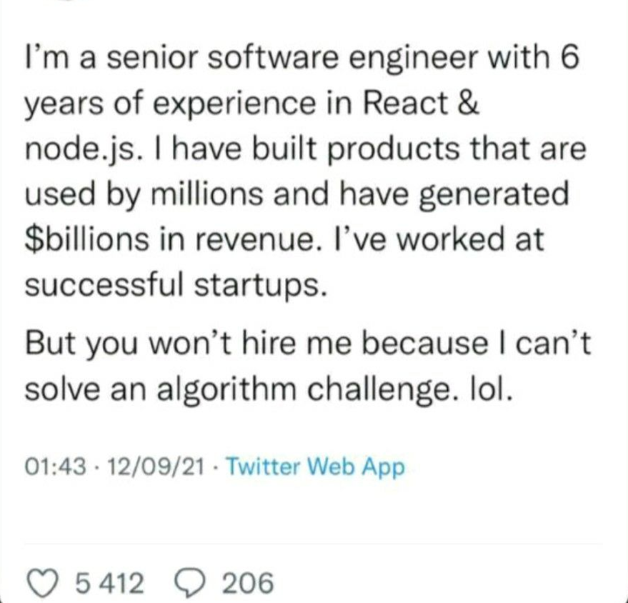

<!--

Esses dias li esse post viral no Linkedin, a princípio veio um incômodo, que sucedeu algumas reflexões e conversas com conhecidos...
Eu pensava que, no geral, esse era um critério muito ruim para uma vaga também, quer dizer, existem tantos aspectos importantes num código: manutenibilidade, testes, extensibilidade, consistência, simplicidade. O que um teste de algoritmos poderia avaliar de tudo isso? Um maratonista é melhor programador? Solucionar desafios e avaliar complexidade de código são sempre fundamentais?

### Qual o profissional você quer ser?

Uma das coisas importantes na análise de requisitos que o mercado praticamente desconhece é a priorização de requisitos não funcionais. Nessa análise é possível ver tanto qual vai ser a demanda de competências/especialidades, quanto os aspectos mais importantes para o sucesso do projeto. Exemplo: Para um aplicativo bancário, quais dentre os critérios abaixo são mais importantes para o **usuário**?

    - Eficiência
    - Usabilidade
    - Segurança
    - Integridade

Agora pense nesses mesmos requisitos para um e-commerce. Não é difícil classificar certo? Sabemos que minimamente todos esses critérios devem ser atendidos, mas um Banco sem segurança e integridade nos seus produtos perderia credibilidade e provavelmente muito dinheiro a cada falha. Já um e-commerce, por outro lado, caso os usuários não consigam navegar com facilidade, a taxa de evasão seria crescente, o que é tolerável para um é inaceitável para outro... Nesse sentido cabe a questão: Qual problema que te atrai mais?

Não é menos ser um profissional focado em resolver problemas de usabilidade, especialista em alguma tecnologia, ter viés de segurança ou mesmo só ser um "faz-tudo", mas num cenário que se exige um perfil que saiba otimizar o desempenho de um software onde cada milisegundo faz toda diferença, talvez faça sentido uma vaga ter uma prova de algoritmos certo?

Posso ir além, qual seria o critério mais justo de avaliação de duas pessoas com backgrounds parecidos para uma vaga? Minha resposta é: a capacidade de absorver e resolver problemas. Devemos concordar que a análise e implementação de algoritmos é uma competência extremamente válida para qualquer cargo não trivial. - Ora, mas o que é um cargo não trivial? Qualquer cargo que necessite mais do que a capacidade de usar tecnologias. De novo, não estou reduzindo um cargo "não trivial", muitas vezes fazer CRUD é o que a pessoa se sente bem fazendo, e não há nada de errado com isso. Mas em contrapartida, ela não pode esperar que se encaixe em uma vaga que isso não é suficiente. -->

> Vocês não estudam cálculo porque vão usar isso diariamente no trabalho, mas porque isso aprimora sua capacidade de raciocínio.

Algum professor disse isso na faculdade, e me marcou. Algoritmos são a mesma coisa, nem sempre é claro como aquilo pode ajudar, para muitos contextos talvez não seja claramente útil, mas no fim isso vai te ajudar. Não é detalhe. A capacidade de analisar e resolver problemas é a mesma exercitada. Mas isso é justamente o contrário ao que a área de TI tem se tornado certo? Uma grande [miojização](https://www.gazetadopovo.com.br/vida-e-cidadania/e-preciso-estar-disponivel-para-o-aprendizado-continuo-diz-cortella-6dkf1o47z4o1sw2xbmdstg296/) do conhecimento, que supervaloriza resultados rápidos através de habilidades técnicas, subestimando a necessidade de fundamentação.

Não parece ser mais tão importante no mercado, para grande maioria das vagas, ter um conhecimento aprofundado em tópicos fundamentais como: algoritmos, sistemas operacionais, redes ou arquitetura de software. Nem mesmo ter capacidade de resolver problemas. Basta ter experiência ou afinidade em uma tecnologia X ou Y... O grande problema disso é que as resoluções costumam ser tendenciosas e terceirizadas para tecnologias.

Terceirizar uma solução significa confiar que algo pronto vai fazer ou facilitar a vida do desenvolvedor(menos trabalho), e do cliente(satisfeito em pagar/esperar menos, num primeiro momento). Porque desenvolver um sistema com uma solução sólida, eficiente, precisa no meu entendimento, de uma compreensão de conceitos, e da competência exercitada de um solucionador, e não de um profissional que aplica tecnologias que se encaixam no problema, fazendo parecer bonito. Desso último saem muitas pérolas como já presenciei: uso de http para tudo, aplicação lenta com trecho de código em O(n!), ferramenta de concorrência sendo utilizada para um problema que não existia, uso de bibliotecas para problemas simples, e por aí vai.

O fim disso não sei, talvez vai existir uma segunda crise do software, talvez teremos em algum momento uma filtragem de profissionais, o que eu poderia dizer é que não vai deixar de ser importante conhecer os fundamentos. Bato nesta tecla para colegas que querem entrar no mercado, **esse é um ponto diferencial**. Enfim, não ache ruim quando te aplicam uma prova técnica, quem sabe o contratante sabe exatamente o que quer.
